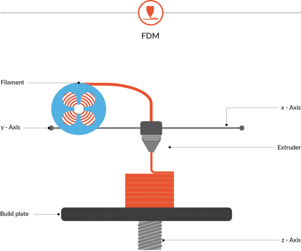
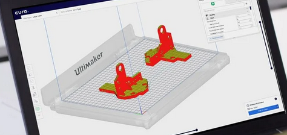
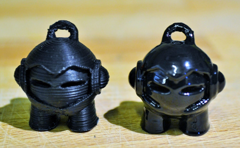
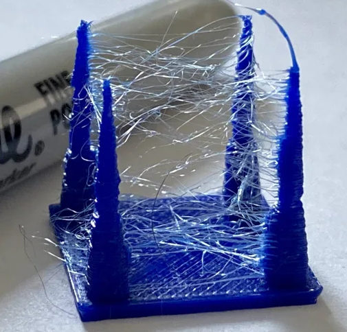

----
marp: true
class:
  - invert
----

# Introduction to 3D Printing

---

# What we're talking about

- Basics of 3D printing
- How to get started
- Overview of the 3D printing process
- Troubleshooting prints

---

# What is 3D Printing?

# &nbsp;➕ &nbsp;&nbsp;&nbsp;&nbsp;&nbsp;&nbsp;&nbsp;&nbsp;❌
additive **vs** subtractive manufacturing

---

<!-- _class: lead -->

# Fused Deposition Modeling (FDM)
  
  A continuous stream of melted materials is **extruded through a nozzle** and is immediately solidified together with existing layers on the build plate.

---

<!-- _theme: default -->
<!-- _class: default -->

## Basic Anatomy

---

# Why 3D Printing?

😻 Cat toys!!! 😻
- Useful for prototyping ideas
- Making tailored items to your needs (like organizing your paint collection or wires)
- Fix things around your house or car parts
- Give unique gifts

---

# How to get started
1. Get a 3D printer
2. Get filament
3. Get some `.gcode` files

&nbsp;&nbsp;&nbsp;&nbsp;&nbsp;&nbsp;....

4. 🤑 Profit 🤑

---

<!-- _class: default -->

## but really...

### 3D process:

1. Get the 3D digital model
2. Slice it
3. Print it (and potentially troubleshoot it)
4. Post-process it

---

# 3D Printer Recommendations

[Prusa Mini](https://shop.prusa3d.com/en/3d-printers/994-original-prusa-mini.html#) and [Creality Ender 3 Pro](https://www.creality.com/goods-detail/ender-3-pro-3d-printer)

---

# Prusa Mini
**Price: $359**

✅  Great integration with [PrusaSlicer](https://www.prusa3d.com/prusaslicer/)
✅  Auto-bed leveling

❌  Not fully open-source
❌  More expensive

---

<!-- _class: default -->
<!-- _backgroundColor: white -->

# Ender 3 Pro
**Price: $250**

✅  Open source
✅  Easy to assemble
✅  Easy to upgrade
✅  Removable magnetic bed

❌  Manual bed leveling

(Available at [MicroCenter](https://www.microcenter.com/product/608315/creality-ender-3-pro-3d-printer))

---

# setting up your own printer

- Be patient and be precise
- Recommended YouTube Videos:
  - [Tomb of 3D Printer Horrors' Ender 3 Assembly Guide](https://www.youtube.com/watch?v=me8Qrwh907Q)
  - [Josef Prusa's Assembly Guide](https://www.youtube.com/watch?v=vA954VvdquA)

--- 

# Rite of passage: leveling your bed

---

# Bed squares

Prints 9 squares around your bed to ensure the nozzle is calibrated with the bed.

[Thingiverse 34558](https://www.thingiverse.com/thing:34558)

---

# Z-Axis Alignment posts

Tests your speed and temperature for prints to diagnose spiderweb issues

[Thingiverse 1138928](https://www.thingiverse.com/thing:1138928)

----

# XYZ calibration cube

Helps narrow down troubles occurring on specific access like a loose belt or Z-wobble

[Thingiverse 1278865](https://www.thingiverse.com/thing:1278865)

---

<!-- _class: default -->

# Important things about Filament

- Extruder determine the filament size (1.7mm or 3.00mm).
- Each filaments prints best at different temperatures, sizes, and will need different bed adhesion needs.
  - Ensure you check optimal temperature range on the packaging.
  - You may need to upgrade your nozzle/hot end assembly if you want to print anything out of the ordinary.
- Different filaments can be studier/flexible than others. PLA **will melt** with long enough exposure to heat.
- If you like a particular filament, take note of the brand and where you got it. Qualities vastly change among brands even if it has similar characteristics.

---

# PLA

**Extruder Temperature:** 190°C - 230°C
**Bed Temperature:** 60°C - 80°C
**Ventilation Needed:** No
**Common Uses:**
  - Household objects
  - Organizers
  - Figurines
  - Medical implants

---

# ABS

**Extruder Temperature:** 210°C – 250°C
**Bed Temperature:** 80°C-110 °C
**Ventilation Needed:** Yes
**Common Uses:**
  - Auto parts
  - Sports equipment

---

# HIPS

**Extruder Temperature:** 210°C – 250°C
**Bed Temperature:** 80°C-110 °C
**Ventilation Needed:** No
**Common Uses:**
  - Support for complex prints
  - Models
  - Miniatures/figurines
  - Costumes
  
⭐  biodegradable ⭐

---

# Nylon

**Extruder Temperature:** 210°C – 250°C
**Bed Temperature:** 60°C - 80°C
**Ventilation Needed:** No
**Common Uses:**
  - Mechanical parts
  - Containers
  - Gears and bearings
  
📓 Very durable, water resistant, and flexibility. Has high melting temperature. 

---

# Wood

**Extruder Temperature:** 200°C - 260°C
**Bed Temperature:** 90°C-110°C
**Ventilation Needed:** No
**Common Uses:**
  - Anything wood-related without the wood working skills 😎

---

<!-- _class: default -->
<!-- _backgroundColor: #303033 -->
<!-- _color: #f8f8ff -->

# FOOD?!

(... but seriously.)

---

# Changing filament

Basic process (printers may vary):

- Preheat heating assembly
- Extruder few millimeters of the old filament
- Take the old filament out
- Insert new filament
- Extruder new filament until the color completely changes

---

# Enclosures

- Recommended if you have small creatures or humans
- Helps maintain constant air temperature and flow
- Most PLA filaments are nontoxic. If you notice you get a headache while you're printing, check your air filteration.
- Absolutely a must if you print with ABS filament
  
👉 [IKEA LACK enclosure](https://www.thingiverse.com/thing:3052378) 👉

----

# Mods!

## [Glass bed](https://www.creality3dofficial.com/collections/accessories/products/creality-new-upgraded-heated-bed-build-plate-surface?sca_ref=10788.CFDqhuwn3C)

- Better surface adhesion for prints
- Bottom is smooth

---

<!-- _class: default -->

# Mods!

## [BLTouch](https://www.amazon.com/dp/B01FFV2TOS?k=BLTOUCH&tag=all3dp0c-20)

Auto-level your bed!

⭐ Available at [MicroCenter](https://www.microcenter.com/product/625598/creality-bl-touch-auto-bed-leveling-sensor-for-cr--ender-series)

---

# Mods!

## [OctoPrint](https://octoprint.org/)

- Need a Pi 4
- Control and observe your 3D printer from the browser

---
<!-- _class: default -->

# From digital concept to real thing!

---

---

# or!
explore [Thingiverse](https://www.thingiverse.com/)

but this comes with pre-compiled STL files, which is really hard to modify if you don't have the original pre-compiled version

---

# Slicing

To transform your print to `gcode`.

**Recommendation:** [Utlimaker Cura](https://ultimaker.com/software/ultimaker-cura)

**Terminology:**
  - _Profile_: How detailed to make the print
  - _Infill_: How much to fill the solid
  - _Support:_ Breakable pieces that help support hanging pieces during print

---

# Post-processing

- Remove supports with plyers
- Use a file 
  - Go slow on PLA
- Take safety precautions! Wear a mask and gloves if necessary.
- If you want to sand, electric sanders work best going between 80 grit and 120/240 dry.
- Polish with Tetrahydrofuran (THF) for PLA and acetone vapor for ABS

---

# Maintenance

## Every time you print
- Level it (if needed)
- Clean bed after every print with rubbing alcohol

## After 1500 hours of printing
- Disassemble the extruder and brush excess material from the filament wheel teeth.
- Perform several cold filament pulls on the nozzle. 
- Check all the belts for tightness and fraying (replace or tighten as needed)
- Check that all screws throughout the printer are tight.
- Oil all the rods with good Synthetic Oil With PTFE (High Viscosity).

---
<!-- _class: default -->

# Diagnosing misprints

---

## Bed adhesion

- Check temperature of bed
- Air flow of the printer
- Use stick glue

---

## Spiderwebs

- Slow down speed
- Look at temperature

---

# Resources

- https://www.reddit.com/r/3dprinting/wiki/gettingstarted
- https://www.reddit.com/r/functionalprints
- https://www.all3dp.com
- https://thingiverse.com
- **Tomb of 3D Printed Horrors:** https://www.youtube.com/channel/UC5Lbnd97HV3rU98gcwHklzQ
- https://3dprinterchat.com/3d-printer-maintenance/
- **Post-Processing:**
  - https://pinshape.com/blog/post-processing-your-pla-and-abs-prints/
  - https://www.makerbot.com/professional/post-processing/ 
  - https://letsprint3d.net/2017/09/19/guide-how-to-finish-3d-prints/